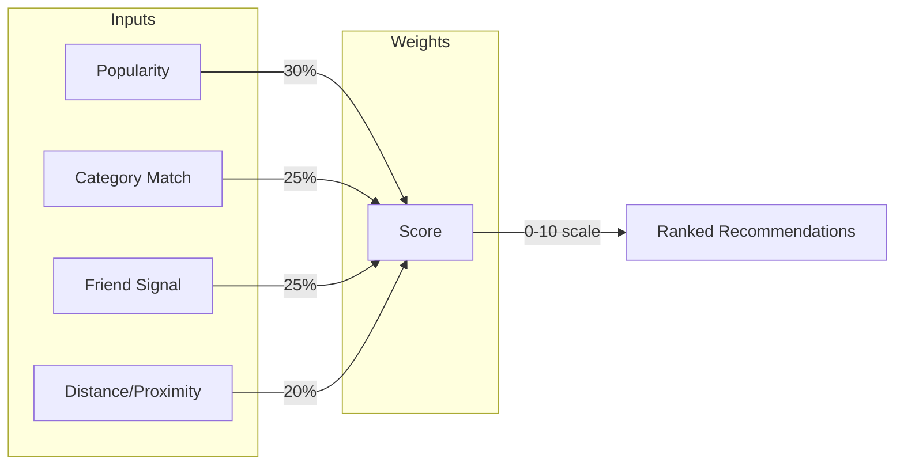

# Luna - Social Venue Discovery Platform

**A full-stack iOS application for discovering venues with intelligent recommendations and social coordination**

   

## 📬 Quick Links

- **GitHub:** [Krut-in/SwiftAssessment](https://github.com/Krut-in/SwiftAssessment)
- **Email:** krutin31@gmail.com

## 🎯 Overview

Luna is a venue discovery app built with Swift/SwiftUI and Python/FastAPI. Users discover venues, express interest, see friends' activity, and receive personalized recommendations. An intelligent booking agent creates action items when 5+ users express interest.

**Core Value Proposition:**
- **Zero friction discovery** - Personalized "For You" feed with scored recommendations
- **Social coordination** - "Hot Right Now" venues, friend activity timeline
- **Intelligent automation** - Action items triggered at 5+ interested users
- **Transparent scoring** - 0-10 scale with full breakdown (popularity, category, friends, proximity)

---

## ✅ Features

### iOS App (4-Tab Navigation)

| Tab | Features |
|-----|----------|
| **Discover** | Lazy-loaded venue list, category filter bar, map/list toggle, advanced filtering (distance, interests), sorting (popularity, distance, friends, name) |
| **For You** | Personalized recommendations with 0-10 scores, visual score breakdown with progress bars |
| **Social** | "Hot Right Now" (5+ friends interested), friend activity timeline with pagination, plan meetup (coming soon) |
| **Profile** | User switcher (4 demo users), interested venues grid, action items, dark mode toggle |

**Key Interactions:**
- Interest toggle with haptic feedback and optimistic updates
- Action item toast notifications (global overlay)
- Pull-to-refresh, infinite scroll pagination
- Deep linking support (`luna://venues/{id}`)

### Backend (9 API Endpoints)

**Venues**
- `GET /venues` - List with filtering/sorting
- `GET /venues/{id}` - Detail with interested users

**Interests**
- `POST /interests` - Toggle interest (triggers booking agent)

**Users**
- `GET /users/{id}` - Profile with venues and action items

**Recommendations**
- `GET /recommendations` - Personalized scored suggestions

**Social**
- `GET /social/feed` - Paginated friend activity

**Action Items**
- `POST /action-items/{id}/complete` - Complete item
- `DELETE /action-items/{id}` - Dismiss item

---

## 🏗️ Architecture

### System Diagram

```
┌─────────────────────────────────────────────────────────────┐
│                    iOS App (SwiftUI + MVVM)                 │
├─────────────────────────────────────────────────────────────┤
│  Views (11)          ViewModels (5)       Services (6)      │
│  ├─ VenueFeedView    ├─ VenueFeedVM       ├─ APIService     │
│  ├─ RecommendedFeed  ├─ RecommendedFeedVM ├─ AuthService    │
│  ├─ SocialFeedView   ├─ SocialFeedVM      ├─ AnalyticService│
│  ├─ ProfileView      ├─ VenueDetailVM     ├─ NotificationSvc│
│  ├─ VenueDetailView  └─ ProfileVM         ├─ ImageCacheSvc  │
│  └─ 14 Components                         └─ Persistence    │
│                                                             │
│  AppState (Singleton) ◄──── Global state management         │
│  ThemeManager ◄──────────── Dark mode + design system       │
└────────────────────────────┬────────────────────────────────┘
                             │ HTTP/JSON (REST)
┌────────────────────────────▼────────────────────────────────┐
│                  Backend (Python/FastAPI)                   │
├─────────────────────────────────────────────────────────────┤
│  main.py ──► Pydantic Models ──► SQLAlchemy ORM             │
│      │              │                   │                   │
│      ▼              ▼                   ▼                   │
│  agent.py      api_models.py       SQLite DB                │
│  (Booking)     db_models.py        (7 tables)               │
└─────────────────────────────────────────────────────────────┘
```

### Recommendation Scoring Algorithm



**Scoring Formula:** `score = (popularity × 0.30) + (category_match × 0.25) + (friend_signal × 0.25) + (proximity × 0.20)`

### Interest Toggle Flow

```
User taps heart → Haptic feedback + scale animation (1.2x)
       ↓
Optimistic UI update → Local state reflects change immediately
       ↓
API call → POST /interests (toggle behavior)
       ↓
Backend checks threshold → If 5+ users: Trigger booking agent
       ↓
Response → Success: Keep update | Error: Rollback | Booking: Show toast
```

---

## 🚀 Setup Instructions

### Prerequisites

| Component | Requirement |
|-----------|-------------|
| **Backend** | Python 3.10+, pip |
| **iOS** | macOS, Xcode 15.0+, iOS 17.0+ Simulator |

### Backend Setup

```bash
cd Luna-Backend
chmod +x setup.sh && ./setup.sh
source venv/bin/activate
uvicorn main:app --reload --port 8000
```

Verify: `http://localhost:8000/docs` (Swagger UI)

### iOS Setup

```bash
open name/name.xcodeproj
```

1. Select iPhone 15 Pro simulator
2. **Important:** Update `baseURL` in `name/Services/APIService.swift` to your machine's IP
3. Press `Cmd+R` to build and run

---

## 🛠️ Technology Stack

### iOS (Zero External Dependencies)

| Framework | Purpose |
|-----------|---------|
| SwiftUI | Declarative UI (iOS 17+) |
| Combine | Reactive data flow |
| Foundation/URLSession | Native async networking |
| CoreData | Local persistence |
| MapKit | Map view integration |

### Backend

| Package | Version | Purpose |
|---------|---------|---------|
| FastAPI | 0.115.0 | Async web framework |
| Uvicorn | 0.32.0 | ASGI server |
| Pydantic | 2.9.0 | Data validation |
| SQLAlchemy | 2.0.35 | Async ORM |
| aiosqlite | 0.20.0 | SQLite async driver |

---

## 🎨 Design Decisions

| Decision | Choice | Rationale |
|----------|--------|-----------|
| **Architecture** | MVVM | Works seamlessly with SwiftUI's @Published, testable |
| **Backend** | FastAPI + SQLite | Built-in async, Pydantic validation, no separate DB server |
| **iOS Dependencies** | Native only | Lightweight, Apple-supported, URLSession sufficient |
| **State Management** | Singleton AppState | Single source of truth for global state |
| **Theme System** | Custom Theme.swift | Centralized colors, fonts, spacing, animations |
| **Dark Mode** | ThemeManager + @AppStorage | Persistent preference with system integration |
| **Auth** | Demo mode (4 users) | User switcher for testing different personas |
| **Action Threshold** | 5+ users | Triggers booking agent for popular venues |

---

## 📊 Project Statistics

| Metric | Value |
|--------|-------|
| iOS Views | 11 screens + 14 components |
| API Endpoints | 9 fully functional |
| Database Models | 7 SQLAlchemy tables |
| Tab Navigation | 4 tabs |
| Demo Users | 4 switchable |
| Dependencies (iOS) | 0 (native only) |
| Dependencies (Backend) | 6 packages |

---

## 🤖 AI & Third-Party Resources

**Coding Agents Used:**
- **GitHub Copilot** - Code completion and boilerplate generation throughout development
- **Claude AI** - Architecture planning, complex logic implementation, and code review

**Templates & Resources:**
- SwiftUI MVVM patterns from Apple's documentation
- FastAPI async patterns from official tutorials
- Haversine distance formula for proximity calculations

---

## 📄 License

Portfolio/assessment application. Not licensed for commercial use.

---

## 🙏 Acknowledgments

**Built with ❤️ by Krutin Rathod**

Swift 5.9 • SwiftUI • Python 3.10 • FastAPI • SQLAlchemy • SQLite
